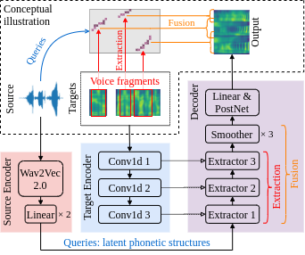
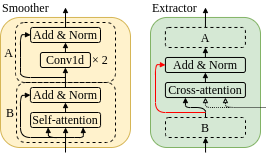

# FragmentVC

Here is the official implementation of the paper, [FragmentVC: Any-to-Any Voice Conversion by End-to-End Extracting and Fusing Fine-Grained Voice Fragments With Attention](https://arxiv.org/abs/2010.14150).
In this paper we proposed FragmentVC, in which the latent phonetic structure of the utterance from the source speaker is obtained from Wav2Vec 2.0, while the spectral features of the utterance(s) from the target speaker are obtained from log mel-spectrograms.
By aligning the hidden structures of the two different feature spaces with a two-stage training process, FragmentVC is able to extract fine-grained voice fragments from the target speaker utterance(s) and fuse them into the desired utterance, all based on the attention mechanism of Transformer as verified with analysis on attention maps, and is accomplished end-to-end.

The following are the overall model architecture and the conceptual illustration.



And the architecture of smoother blocks and extractor blocks.



For the audio samples and attention map analyses, please refer to our [demo page](https://yistlin.github.io/FragmentVC/).

## Usage

You can download the pretrained model as well as the vocoder following the link under **Releases** section on the sidebar.

The whole project was developed using Python 3.8, torch 1.6, and the pretrained model as well as the vocoder were turned to [TorchScript](https://pytorch.org/docs/stable/jit.html), so it's not guaranteed to be backward compatible.
You can install the dependencies with

```bash
pip install -r requirements.txt
```

If you encounter any problems while installing *fairseq*, please refer to [pytorch/fairseq](https://github.com/pytorch/fairseq) for the installation instruction.

### Wav2Vec

In our implementation, we're using Wav2Vec 2.0 Base w/o finetuning which is trained on LibriSpeech.
You can download the checkpoint [wav2vec_small.pt](https://dl.fbaipublicfiles.com/fairseq/wav2vec/wav2vec_small.pt) from [pytorch/fairseq](https://github.com/pytorch/fairseq).

### Vocoder

The WaveRNN-based neural vocoder is from [yistLin/universal-vocoder](https://github.com/yistLin/universal-vocoder) which is based on the paper, [Towards achieving robust universal neural vocoding](https://arxiv.org/abs/1811.06292).

## Voice conversion with pretrained models

You can convert an utterance from source speaker with multiple utterances from target speaker, e.g.
```bash
python convert.py \
    -w <WAV2VEC_PATH> \
    -v <VOCODER_PATH> \
    -c <CHECKPOINT_PATH> \
    VCTK-Corpus/wav48/p225/p225_001.wav \ # source utterance
    VCTK-Corpus/wav48/p227/p227_002.wav \ # target utterance 1/3
    VCTK-Corpus/wav48/p227/p227_003.wav \ # target utterance 2/3
    VCTK-Corpus/wav48/p227/p227_004.wav \ # target utterance 3/3
    output.wav
```

Or you can prepare a conversion pairs information file in YAML format, like
```YAML
# pairs_info.yaml
pair1:
    source: VCTK-Corpus/wav48/p225/p225_001.wav
    target:
        - VCTK-Corpus/wav48/p227/p227_001.wav
pair2:
    source: VCTK-Corpus/wav48/p225/p225_001.wav
    target:
        - VCTK-Corpus/wav48/p227/p227_002.wav
        - VCTK-Corpus/wav48/p227/p227_003.wav
        - VCTK-Corpus/wav48/p227/p227_004.wav
```

And convert multiple pairs at the same time, e.g.
```bash
python convert_batch.py \
    -w <WAV2VEC_PATH> \
    -v <VOCODER_PATH> \
    -c <CHECKPOINT_PATH> \
    pairs_info.yaml \
    outputs # the output directory of conversion results
```

After the conversion, the output directory, `outputs`, will be containing
```text
pair1.wav
pair1.mel.png
pair1.attn.png
pair2.wav
pair2.mel.png
pair2.attn.png
```
where `*.wav` are the converted utterances, `*.mel.png` are the plotted mel-spectrograms of the formers, and `*.attn.png` are the attention map between *Conv1d 1* and *Extractor 3* (please refer to the model architecture above).

## Train from scratch

Emperically, if you train the model on the CSTR VCTK Corpus, it would take 1 hr to preprocess the data and around 12 hr to train to 200K steps (on an RTX 2080 Ti).

### Preprocessing

You can preprocess multiple corpora by passing multiple paths.
But each path should be the directory that directly contains the speaker directories,
i.e.
```bash
python preprocess.py \
    VCTK-Corpus/wav48 \
    LibriTTS/train-clean-360 \
    <WAV2VEC_PATH> \
    features  # the output directory of preprocessed features
```

After preprocessing, the output directory will be containing:
```text
metadata.json
utterance-000x7gsj.tar
utterance-00wq7b0f.tar
utterance-01lpqlnr.tar
...
```

### Training

```bash
python train.py features --save_dir ./ckpts
```

You can further specify `--preload` for preloading all training data into RAM to boost training speed.
If `--comment <COMMENT>` is specified, e.g. `--comment vctk`, the training logs will be placed under a newly created directory like, `logs/2020-02-02_12:34:56_vctk`, otherwise there won't be any logging.
For more details, you can refer to the usage by `python train.py -h`.
